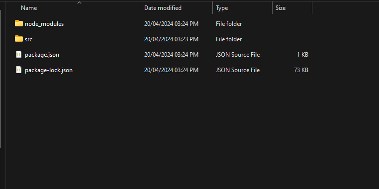
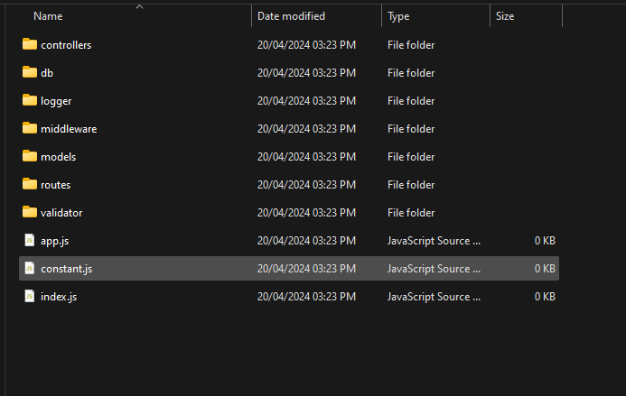

# Node.js Project Initializer

This script automates the setup process for a Node.js project, creating a structured folder layout and installing essential dependencies.

## Table of Contents

-   [Prerequisites](#1-prerequisites)
-   [Getting Started](#2-getting-started)
-   [Results](#3-results)
-   [Usage](#4-usage-notes)
-   [Contributing](#5-contributing)
-   [Troubleshooting](#6-troubleshooting)

## 1. Prerequisites

-   ### Node.js installed on your system
-   ### npm (Node Package Manager)

## 2. Getting-Started

-   Clone or download this repository to your local machine.
    Open a terminal window and navigate to the directory where you saved the script.

-   Run the script by entering the following command:

```javascript
npm start
```

-   Follow the prompts to enter the desired folder name for your project.
    Folder Structure
    The script will create the following folders within your project directory:

#### --> models: For database models.

#### --> routes: For route handlers.

#### --> controllers: For controller logic.

#### --> logger: For logging functionality.

#### --> validator: For validation logic.

#### --> middleware: For middleware functions.

#### --> db: For database-related files.

#### --> Files Created

### - In addition to the folders, the script will create the following files:

1. constant.js: Placeholder file for constants.
2. .prettierignore: Prettier configuration file ignore list.
3. .prettierrc: Prettier configuration file.
4. .env: Environment variables file.
5. sample.env: Sample environment variables file for reference.
6. README.md: Project README file.
7. index.js: Main entry point for the application.
8. app.js: Express application setup file.

#### --> Installing Dependencies

-   ### The script will automatically initialize an npm project (npm init -y) and install the following dependencies:
    bcrypt,
    cookie-parser,
    cors,
    dotenv,
    express,
    express-rate-limit,
    express-validator,
    helmet,
    jsonwebtoken,
    mongoose,
    morgan,
    winston,

### ✨ Upon completing these steps, you will have a meticulously structured folder, named as per your command input, containing all the requisite sub-folders meticulously organized by the script.

## 3. Results



### - Inside src folder



## 4. Usage Notes

Ensure that you have a stable internet connection during the script execution for dependency installation.
Adjust the delay in the script (setTimeout) as needed based on your internet speed for package installation completion.

## 5. Contributing

Contributions are welcome! If you find any issues or have suggestions for improvement, please open an issue or submit a pull request.

## 6. Troubleshooting

If you encounter any issues with the application, contact sakibdevlekar96@gmail.com for assistance.
